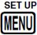
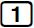
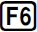
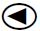

## Exercice 26 page 54

### Position du problème
Dans cet exercice, il est question de mettre en correspondance des fonctions avec des tables de valeur.

Sont données en entrée du problème:
* les expressions des fonctions
1. $ f(x) = x^2 $
2. $ g(x) = x $
3. $ h(x) = x^3 $
4. $ i(x) = \sqrt(x^2) $
5. $ j(x) = \frac {x^2} x $
6. $ k(x) = (\sqrt x)^2 $

* un tableau de valeur images pour des valeurs de $ x$ de l'ensemble {-1, 0, 1, 2}

|x|-1|0|1|2|
|--|--|--|--|--|
|  | -1 | 0 | 1 | 8 |
|  | 1 | 0 | 1 | 2 |
|  | -1 | 0 | 1 | 2 |
|  | non définie | 0 | 1 | 2 |
|  | -1 | non définie | 1 | 2 |
|  | 1 | 0 | 1 | 4 |

L'objectif de l'exercice est de trouver, pour chaque ligne du tableau, la fonction dont les images sont sur cette ligne. Les antécédents étant les valeurs en tête de colonne.

### Méthode de vérification

Pour vérifier nos réponses grâce à une calculatrice CASIO nous allons lui faire calculer, pour chacune des fonctions données, les valeurs images correspondant aux antécédents.

#### Saisie des fonctions
La première étape consiste à programmer les fonctions concernées. Pour cela nous allons dans la fonction _TABLE_ de la calculatrice  en appuyant sur  puis 

Là, nous saisissons les expressions mathématiques des fonctions comme suit:
<table><tr><td>
 
 
 
 
 
 

</td><td>
<table><tr><td></td></tr></table>
</td></tr></table>

#### Réglage de l'ensemble des antécédents

Nous allons à présent régler l'ensemble des valeurs pour lesquelles nous voulons évaluer ces fonctions.

Nous allons dans le menu __SET__ en appuyant sur .

Dans l'exercice, les valeurs sont -1, 0, 1 et 2. Cela correspond à un intervale allant de -1 à 2 par pas de 1.

<table><tr><td>

</td><td>

</td></tr></table>

Nous revenons à l'écran précédent en tapant  ou 

#### Affichage des valeurs images

Pour obtenir les valeurs images, par les fonctions préalablement programmées, des antécédents, nous allons dans le menu __TABL__ en appuyant sur  .

<table><tr><td></td></tr></table>

en utilisant les touches de déplac  
<table><tr><td></td></tr></table>
