## Exercice 34 page 55

### Position du problème
Dans cet exercice, il est question d'étudier la correspondance d'âge entre les chiens et les humains.

Un tableau de correspondance d'age d'un chien $ x$ et d'un humain $y$ est donné pour quelques valeurs d'âge:

|age chien: $x$|age humain: $y=H(x)$|
|--|--|
| 0.5 | 10 |
| 1 | 18 |
| 2 | 26 |
| 6 | 42 |
| 12 | 70 |
| 16 | 94 |

L'objectif de l'exercice est de :
* Tracer la courbe,
* trouver l'age humain correspondant à celui d'un chien de 3 ans,
* trouver l'age chien correspondant à celui d'un humain de 60 ans.

### Tracer la courbe

Le première étape pour le tracé consiste à saisir les données dans le tableur: 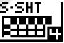
en pressant successivement  puis 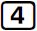.

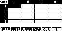

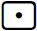 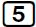 
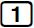 
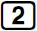 
etc .. pour
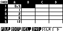

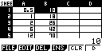

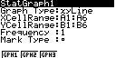
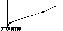

#### Mise à l'échelle

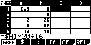
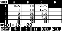

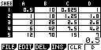

#### Identification de la fonction

CALC

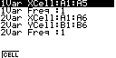

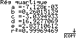

$ H(x) = -7.128*10^{-3}.x^4+0.26015139.x^3-3.0394933.x^2 + 16.9277069x + 2.83710612 $

### Recherche d'images et d'antécédents

Nous commencons par transférer la fonction identifiée précédemment vers le solveur graphique en la copiant par 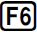(COPY).
Dans l'écran suivant nous sélectionons un emplacement destination:
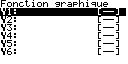 et validons le choix par 

Nous allons maintenant exploiter le solver graphique  
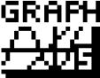
en pressant successivement  puis 
Nous retrouvons la fonction précédement copiée.
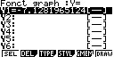

Pour afficher le graphe de la fonction, nous pressons (Draw)
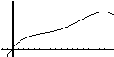

en utilisant les touches de déplac 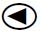 

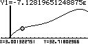

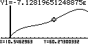
