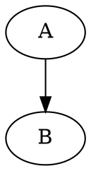
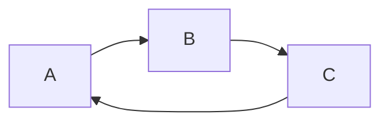

$ f(x) = sin(x)+12 $

$$ \sum_{n=1}^{100} n $$

@import "https://upload.wikimedia.org/wikipedia/commons/6/6b/Bloch_sphere.svg"


```javascript {cmd="node"}
const date = Date.now()
console.log(date.toString())
```


```gnuplot {cmd=true hide=true  output="html"}
set terminal svg
set border lw 1.5
set style line 2 lc rgb '#dd181f' lt 1 lw 3     # --- red

unset key; unset tics; unset border
set lmargin screen 0
set rmargin screen 1
set tmargin screen 1
set bmargin screen 0
set size ratio -1
set view 53,16

set parametric
set isosamples 30
set hidden3d

# Radius
r = 1.0
h = r / sqrt(2.)
set arrow from 0,0,0 to h,0,h front nohead ls 2
set label 'r' at 0.28,0,0.42 textcolor ls 2

set xrange [-1.2:1.2]
set yrange [-1.2:1.2]
set zrange [-1.2:1.2]
set urange [0:3.0/2*pi]
set vrange [-pi/2:pi/2]

# Parametric functions for the sphere
fx(v,u) = r*cos(v)*cos(u)
fy(v,u) = r*cos(v)*sin(u)
fz(v)   = r*sin(v)

splot fx(v,u),fy(v,u),fz(v)
```


```puml
A -> B
```

```sequence
a->B:coucou
```





<div class="mermaid">
gantt
    title A Gantt Diagram
    dateFormat  YYYY-MM-DD
    section Section
    A task           :a1, 2014-01-01, 30d
    Another task     :after a1  , 20d
    section Another
    Task in sec      :2014-01-12  , 12d
    another task      : 24d
</div>
