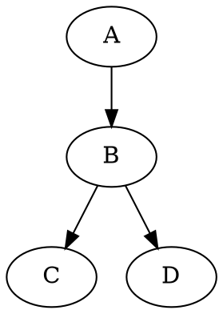
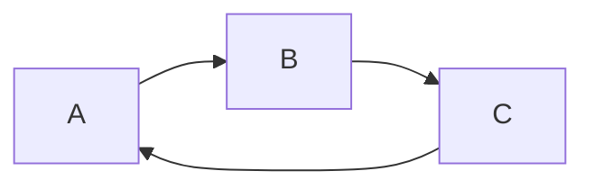
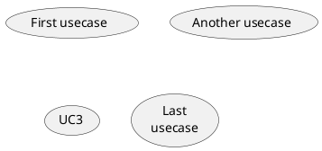

```sequence
Andrew->China: Says Hello
```



```flow
st=>start:
e=>end
```

```sequence {theme="hand"}
Andrew->China: Says Hello
```




```ditaa {cmd=true args=["-E"]}
+----------------+            +-------------------+
|                |            |                   |
|                |            |                   |
|      process A +----------->+   Process B       |
|                |            |                   |
|                |            |                   |
+------+---------+            +-----------+-------+
       |                                  ^
       |                                  |
       |                                  |
       |                                  |
       |        Retro action              |
       +----------------------------------+
```



