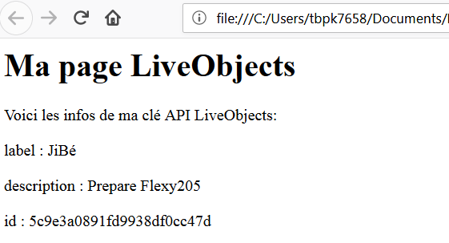

# Premier échange avec LiveObjects

Dans cet article, nous allons voir comment interagir avec LiveObjects en javascript à travers un exemple simple: une application web qui affiche les informations relatives à une clé API LiveObjects.





Nous partirons d'un patron élémentaire de page HTML:

```html
<html>
   <head>
    <meta charset="utf-8" />
    <title>Mon Appli LiveObjects</title>
   </head>
    <body>
      <h1>Ma page LiveObjects</h1>
      <div id="root"></div>
     	<script>
// Insérer le code javascript ici
    	</script>
   </body>
</html>
```

Dans la partie script, nous ajoutons une fonction nous permettant d'afficher un texte dans le corp de la page HTML:

```javascript
function affiche (texte) {
  let para = document.createElement('p');
  para.textContent = texte
  document.getElementById('root').appendChild(para);
}
```

que nous pouvons appeller de la façon suivante:

```javascript
affiche ("Voici les infos de ma clé API LiveObjects: ");
```


Nous programmons ensuite une fonction `retrieveKeyInfo (api_key, key_info_received, key_error)` qui demande à la plateforme LiveObject les informations relatives à la clé API en cours d'utilisation `api_key` et qui les passe en paramètre à la fonction `key_info_received` si la clé est reconnue par LiveObject. Si la clé n'est pas reconnue ou si une erreur réseau s'est produite à la récupération des informations, c'est la fonction `key_error` qui sera appelée si elle est définie.

```javascript
function  retrieveKeyInfo (api_key, key_info_received, key_error = undefined) {
  let request = new XMLHttpRequest()

  request.open('GET','https://liveobjects.orange-business.com/api/v0/apiKeys/current_key', true)
  request.setRequestHeader("X-API-KEY",api_key)
  request.setRequestHeader("Accept",'application/json')

  request.onload = function () {
    var data = JSON.parse(this.response)
    if (request.status == 200) {
      key_info_received(data)
    } else {
       if (request.status == 400) {
         console.log('error 400')
       } else if (request.status == 404){
         console.log('error 404')
       } else {
         console.log('error '+ request.status)
       }
       if (key_error !== undefined) {key_error()}
    }
  }
  request.send()
}
```

Toujours dans la partie script de notre page HTML, nous combinons la fonction d'affichage de texte et la fonction récupérant les informations sur la clé API pour afficher les détails de notre clé dans la page web.


```javascript
retrieveKeyInfo ("METTRE LA CLE API ICI",
   key_info_received = (key_info) => {
     affiche ("Voici les infos de ma clé API LiveObjects: ");
     affiche (`label : ${key_info.label}`);
     affiche (`description : ${key_info.description}`);
     affiche (`id : ${key_info.id}`);
   },
   key_error = ()=> {
     alert("Mauvaise clé API ou connexion KO")
   }
)
```
