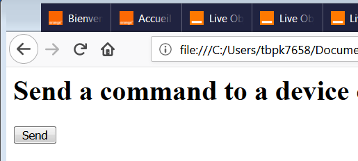
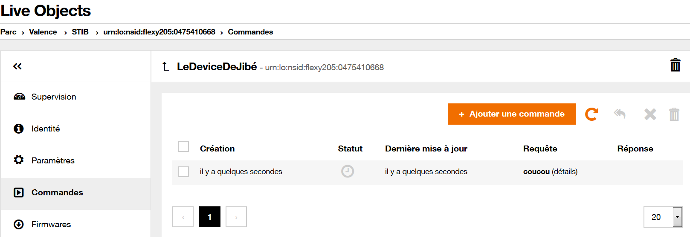

# Envoyer une commande à un device MQTT


Dans cet article, nous allons voir comment déclencher l'envoi d'une commande à un device LiveObjects sur l'appui d'un bouton dans une page Web.




La commande aura la structure suivante:

```javascript
let newCommand = {
  "request": {
    "connector": "mqtt",
    "value": {
      "req": "coucou",
      "arg": {
        "delay": 1000
      }
    }
  },
  "policy": {
    "expirationInSeconds": 120,
    "ackMode": "DEVICE"
  },
  "notifyTo": "fifo/commandStatusUpdates"
}
```

et, pour faciliter l'exposé, nous codons en dur l'identifiant du device auquel envoyer une commande.

```javascript
const DEVICE_ID="urn:lo:nsid:flexy205:0475410668";
```

Nous partons du template HTML suivant:

```html
<html>
   <head>
    <meta charset="utf-8" />
    <title>Mon Appli LiveObjects</title>
    <script src="scripts/jblo.js" type="text/javascript"></script>
   </head>
    <body>
      <h1>Une page LiveObjects</h1>
      <div id="root"></div>
     	<script>

function Main(api_key) {

  // Ici votre code Live Objects

}
obtainApiKey (document.getElementById("root"), onValidValue= Main, onInvalidValue= (invkey)=>{})

    	</script>
   </body>
</html>
```


Pour envoyer une commande, nous utiliserons le même procédé que celui employé dans le [service d'ajout de commande par POST du swagger LiveObjects](https://liveobjects.orange-business.com/swagger-ui/index.html#!/Device_management_-_Commands_-_V1/addCommandUsingPOST_1).

Nous créons une fonction `createCommand(api_key, device_id, command_obj, commandSent)` qui envoie une commande `command_obj` au device `device_id` et appelle la fonction `commandeSent` lors que la plateforme LiveObjects a acquitté le passage de la commande.


```javascript
function createCommand(api_key, device_id, command_text, commandSent, onError = undefined) {

  var request = new XMLHttpRequest()
  let encodedDeviceId = encodeURIComponent(device_id)
  let url = 'https://liveobjects.orange-business.com/api/v1/deviceMgt/devices/'+encodedDeviceId+'/commands'

  request.open('POST', url, true);

  request.setRequestHeader("X-API-KEY",api_key)
  request.setRequestHeader("Accept",'application/json')
  request.setRequestHeader("Content-type",'application/json')

  request.onload = function (event) {
    if (this.status === 201) {
        commandSent(JSON.parse(this.responseText))
    } else {
        console.log("Echec lors de la création d'une commande %d (%s)", this.status, this.statusText);
        if (onError !== undefined) onError();
    }
  };
  body = JSON.stringify(command_text)
  request.send(body);
}
```

La fonction d'envoi de commande ci-dessous sera déclenchée lorsque l'utilisateur aura cliqué sur un bouton que nous ajoutons à notre page HTML (juste avant la section `root`)

```html
<button id="btn_envoi"  onclick="Clicked()">Envoyer</button>
```

Lorsque l'utilisateur cliquera sur ce bouton, cela appellera la fonction d'envoi de commmande précédemment créée.

```javascript
function Clicked (){
  createCommand(LOAPIKEY, DEVICE_ID, newCommand,
    commandSent = (resp) => {
      console.log(resp);
      affiche(JSON.stringify(resp))
    },
    onError = ()=> {console.log ("ERROR sending command")}
  )
}
```

Pour que la clé  api `LOAPIKEY` soit en visibilité du handler `Clicked`, nous l'initialisons dans le `Main` de notre page web.

```javascript
var LOAPIKEY = undefined;
function Main(api_key) {
  LOAPIKEY = api_key;
}
obtainApiKey (document.getElementById("root"), onValidValue= Main, onInvalidValue= (invkey)=>{})
```

Lorsque l'utilisateur envoie la commande elle devient visible dans la section Commandes relative au device sur le site LiveObject.


