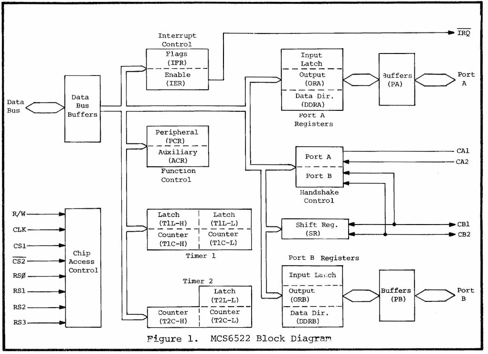
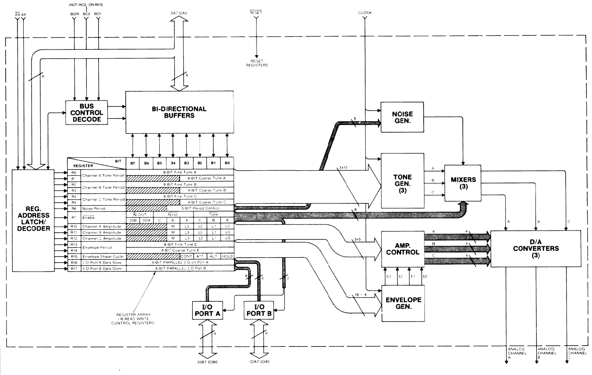
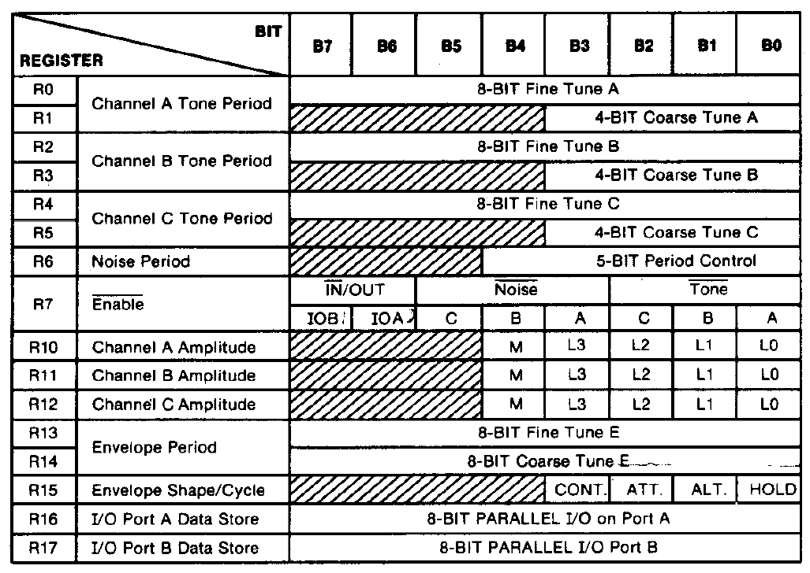

[TOC]


Resources:

[Oric Atmos sur hebdogiciel](http://www.hebdogiciel.free.fr/oric.htm)

[Listings Oric Micro 7](http://abandonlistings.free.fr/micro7/)

[Pages de liens d'André Cheramy](http://andre.cheramy.net/telechargement/Programmes/choix.htm)


# Real ORIC

## MOS 6522



|RS[3:0]|Register|Descritpion| Remark|
|--|--|--|--|
|0|ORB|Output Register B||
|1|ORA|Output Register B||
|2|DDRB|Data Direction B||
|3|DDRA|Data Direction A||
|4|T1L-L / T1C-L|Timer 1 Latch/Counter Low|Write Latch Read Counter|
|5|T1C-H|Timer 1 Counter High| Triggers T1L-L / T1C-L Transfert|
|6|T1L-L|||
|7|T1L-H|||
|8|T2C-L / T2C-L|Timer 2 Latch/Counter Low|Write Latch Read Counter|
|9|T2C-H|Timer 2 Counter High|Triggers T2L-L / T2C-L Transfert|
|A|SR|Shift Register||
|B|ACR|Auxiliary Control Register||
|C|PCR|Peripheral Control Register||
|D|IFR|Interrupt Flag Register||
|E|IER|Interrupt Enable Register||
|F|ORA|||

Port A connects to Printer 8-bit bus and 8912 Sound chip 
Port B connects to Printer 8-bit's 

CA1 inputs acknowledge signal on printer port
CA2 connects to 8912 sound chip
CB1 connected to the cassette input circuitry
CB2 when 1 the 8912 reads from port A of the 6522

## PSG AY3 8912





## La 3D sur Oric:

1337:


Pole Position (1982):
https://www.youtube.com/watch?v=_0xsJJcp_38

3D Fongus: https://www.oric.org/software/3d_fongus-110.html
https://www.youtube.com/watch?v=4Cbynlhs-kk

3D Munch: https://www.oric.org/index.php?page=software&fille=detail&num_log=1007
https://www.youtube.com/watch?v=kQkvrQqbkvA

3D Maze:
https://www.youtube.com/watch?v=zX7WK7H4znc

Loki:
https://www.youtube.com/watch?v=dz0T8B5haE0

Starter 3D:
https://www.youtube.com/watch?v=a3fbSeYWt28


## Connection
https://www.youtube.com/watch?v=9HTE_Dg1W4w
https://www.ebay.co.uk/itm/251137727260
https://www.ebay.co.uk/itm/ORIC-1-ORIC-ATMOS-CASSETTE-TAPE-RECORDER-CABLE-LEADS/321775032876?hash=item4aeb495a2c:g:LQAAAOSwstxU~C-d

# OSDK

[le site de OSK](http://osdk.defence-force.org/index.php?page=main)

configurer une variable d'environnement `OSK` pointant sur le répertoire contenant le répertoire BIN de votre installation.
`set OSDK=PATH\TO\OSDK\DIR`

Pour essayer la construction placez vous dans un des répertoire d'exemple fournit avec le SDK.

|répertoire|description|
|--|--|
| `%OSDK%\assembly\demo_256_bytes`         ||
| `%OSDK%\assembly\game_4kkong`            ||
| `%OSDK%\assembly\hello_world_assembly`   ||
| `%OSDK%\basic\charset_reconf`            ||
| `%OSDK%\basic\game`                      ||
| `%OSDK%\basic\hello_world`               ||
| `%OSDK%\basic\hires_demo`                ||
| `%OSDK%\basic\labels`                    ||
| `%OSDK%\basic\tap2dsk-GameMusics`        ||
| `%OSDK%\basic\tap2dsk-GameMusics\data`   ||
| `%OSDK%\c\compression_test`              ||
| `%OSDK%\c\hello_world_advanced`          ||
| `%OSDK%\c\hello_world_simple`            ||
| `%OSDK%\c\hires_draw`                    ||
| `%OSDK%\c\hires_picture`                 ||
| `%OSDK%\floppybuilder`                   ||
| `%OSDK%\mixed\hello_world_mixed`         ||
| `%OSDK%\mixed\inline_assembler`          ||

Lancer la commande `osdk_build.bat` pour contruire le projet.

Une fois la construction effectuée, lancer la commande `osdk_execute.bat` pour lancer le programme dans l'émulateur `oricutron`.


### Construction d'un programme en ASM

```
%OSDK%\BIN\link65.exe -B -d %OSDK%\lib/ -o %OSDK%\TMP\linked.s -f -q  main.s
%OSDK%\BIN\xa.exe -W -C %OSDK%\TMP\linked.s -o build\final.out -e build\xaerr.txt -l build\symbols -bt $600 -DASSEMBLER=XA  -DOSDKNAME_D
%OSDK%\BIN\header.exe -S1 build\final.out build\D.tap $600
%OSDK%\BIN\taptap.exe ren build\D.tap OSDK 0
```

### Construction d'un programme mixant C et ASM

Pré-processing:

```
%OSDK%\BIN\cpp.exe -lang-c++ -I %OSDK%\include -D
__16BIT__ -D__NOFLOAT__ -DATMOS -DOSDKNAME_HWADVANCED -DOSDKVER=\"1.15\" -nostdinc main.c %OSDK%\TMP\main.c
```
Compile:

```
%OSDK%\BIN\compiler.exe -Nmain -O3 %OSDK%\TMP\mai
n.c  1>%OSDK%\TMP\main.c2
```

Convert C to assembly code :
```bash
%OSDK%\BIN\cpp.exe  \
  -lang-c++         \
  -imacros %OSDK%\macro\macros.h  \
  -DXA -traditional \
  -P %OSDK%\TMP\main.c2 %OSDK%\TMP\main.s
```

???:
```
%OSDK%\BIN\macrosplitter.exe %OSDK%\TMP\main.s %OSDK%\TMP\main
```

Copie fichiers:
```
XCOPY /Y /T print.S %OSDK%\TMP\

COPY print.S %OSDK%\TMP\print.s /Y  1>NUL
```

Edition de liens:
```
%OSDK%\BIN\link65.exe  \
    -d %OSDK%\lib/ \
    -o %OSDK%\TMP\linked.s \
    -f -q  %OSDK%\TMP\main \
    print.s
```

Assemblage:
```
%OSDK%\BIN\xa.exe -W -C %OSDK%\TMP\linked.s   \
    -o build\final.out  \
    -e build\xaerr.txt \
    -l build\symbols \
    -bt $800 \
    -DASSEMBLER=XA  \
    -DOSDKNAME_HWADVANCED
```

Création fichier cassette:
```
%OSDK%\BIN\header.exe  build\final.out build\HWADVANCED.tap $800
```

```
%OSDK%\BIN\taptap.exe ren build\HWADVANCED.tap OSDK 0
```


### Construction d'un programme écrit en Basic


```basic
ECHO #file BomberZ.BAS  1>>%OSDK%\TMP\Bomber.bas

TYPE BomberZ.BAS  1>>%OSDK%\TMP\Bomber.bas

%OSDK%\BIN\Bas2Tap -b2t1 -color1 %OSDK%\TMP\Bomber.bas build\
Bomber.tap
```


### Construction d'un programme mixant assembleur et basique

Préparation du basic
```bash
ECHO #file MAIN.BAS  1>>%OSDK%\TMP\glOricTest.bas
TYPE MAIN.BAS  1>>%OSDK%\TMP\glOricTest.bas

%OSDK%\BIN\Bas2Tap -b2t1 -color1 %OSDK%\TMP\glOricTest.bas build\glOricTest.tap

```

Assemblage des routines assembleurs
```bash
%OSDK%\bin\xa glOric.s -o build\glOric.o

%OSDK%\bin\header -h1 -a0 build\glOric.o build\glOric.tap $6500

```

Si on veut mettre du son
```bash
%OSDK%\bin\ym2mym -t0 data\musique.ym data\musique.mym
%OSDK%\bin\header -h1 -a0 data\musique.mym build\musique.tap $7600

```

Production de la disquette à partir des TAPs

```bash
%OSDK%\bin\taptap ren build\glOricTest.tap "Test" 0

%OSDK%\bin\taptap ren build\glOric.tap "glOric" 0

%OSDK%\bin\taptap ren build\musique.tap "Music1" 0

%OSDK%\bin\tap2dsk -iCLS:TEST build\glOricTest.TAP build\glOric.tap build\musique.tap build\glOricTest.dsk

%OSDK%\bin\old2mfm build\glOricTest.dsk

```

### Execution du programme stocké sur une disquette DSK

```bash

COPY build\glOricTest.TAP %OSDK%\Oricutron\OSDK.TAP  1>NUL
COPY build\glOricTest.DSK %OSDK%\Oricutron\OSDK.DSK  1>NUL
COPY build\symbols %OSDK%\Oricutron\symbols  1>NUL

PUSHD %OSDK%\Oricutron
START oricutron.exe -d OSDK.DSK -s symbols
POPD
```


### Execution du programme stocké sur une cassette TAP


```bash
COPY build\Bomber.TAP %OSDK%\Oricutron\OSDK.TAP  1>NUL

COPY build\symbols %OSDK%\Oricutron\symbols  1>NUL

PUSHD %OSDK%\Oricutron

%OSDK%\Oricutron>START oricutron.exe -t OSDK.TAP -s symbols

%OSDK%\Oricutron>POPD
```


# Assembly

[ASSEMBLEUR 6502](https://www.masswerk.at/6502/assembler.html)

[EASY 6502 ](http://skilldrick.github.io/easy6502/)


## Etudier les opérations 8 bits

```assembler
CLC
LDA #0
ADC #0
STA 1050
PHP
PLA
STA 1051
RTS
```

```
0000        CLC             18
0001        LDA #$00        A9 00
0003        ADC #$00        69 00
0005        STA $041A       8D 1A 04
0008        PHP             08
0009        PLA             68
000A        STA $041B       8D 1B 04
000D        RTS             60
```

```BASIC
5 REM ***** PROGRAM FOR STUDYING SUBTRACT .
10 CL = 0
30 REPEAT
40 READ DTA
50 POKE # 400+CL,DTA
60 CL = CL + 1
70 UNTIL DTA = # FF :REM END OF PROG.

100 DATA # 18, # A9, # 00, # 69, # 00, # 8D, # 1A, # 04
110 DATA # 08, # 68, # 8D, # 1B, # 04, # 60
210 DATA # FF

300 CLS
310 INPUT "ENTREZ X ET Y"; X,Y
320 POKE # 400+2, X : POKE # 400+4, Y
330 CALL 1024
340 PRINT "X+Y=" ; PEEK (1050)
350 LET A=PEEK(1051)
360 PRINT :PRINT "LE REGISTRE P EST ";A
370 FOR T=7 TO 0 STEP -1
380 IF A>2^T-1 THEN B(T)=1 : A=A-2^T
390 NEXT T
400 PRINT "N="; B(7),"V=";B(6), "Z="; B(1), "C="; B(0)
```


## Etudier les opérations 16 bits

### Addition

```
CLC
LDA 1050
ADC 1052
STA 1054
LDA 1051
ADC 1053
STA 1055
PHP
PLA
STA 1049
RTS

```

```BASIC

5 REM ***** PROGRAM FOR STUDYING ADD .
10 CL = 0
30 REPEAT
40 READ DTA
50 POKE # 400+CL,DTA
60 CL = CL + 1
70 UNTIL DTA = # FF :REM END OF PROG.


100 DATA # 18, # AD, # 1A, # 04, # 6D, # 1C, # 04, # 8D
110 DATA # 1E, # 04, # AD, # 1B, # 04, # 6D, # 1D, # 04
120 DATA # 8D, # 1F, # 04, # 08, # 68, # 8D, # 19, # 04
130 DATA # 60
210 DATA # FF

300 CLS
310 INPUT "ENTREZ X ET Y"; X,Y
320 DOKE 1050, X : DOKE 1052, Y
330 CALL 1024
340 PRINT "X+Y=" ; DEEK (1054)
350 LET A=PEEK(1049)
360 PRINT :PRINT "LE REGISTRE P EST ";A
370 FOR T=7 TO 0 STEP -1
380 IF A>2^T-1 THEN B(T)=1 : A=A-2^T
390 NEXT T
400 PRINT "N="; B(7),"V=";B(6), "Z="; B(1), "C="; B(0)

```

### Soustraction

```BASIC

5 REM ***** PROGRAM FOR STUDYING ADD .
10 CL = 0
30 REPEAT
40 READ DTA
50 POKE # 400+CL,DTA
60 CL = CL + 1
70 UNTIL DTA = # FF :REM END OF PROG.


100 DATA # 38, # AD, # 38, # 04, # ED, # 3A, # 04, # 8D
110 DATA # 3C, # 04, # AD, # 39, # 04, # ED, # 3B, # 04
120 DATA # 8D, # 3D, # 04, # 08, # 68, # 8D, # 37, # 04
130 DATA # 60

210 DATA # FF

300 CLS
310 INPUT "ENTREZ X ET Y"; X,Y
320 DOKE 1080, X : DOKE 1082, Y
330 CALL 1024
340 PRINT "X-Y=" ; DEEK (1084)
350 LET A=PEEK(1079)
360 PRINT :PRINT "LE REGISTRE P EST ";A
370 FOR T=7 TO 0 STEP -1
380 IF A>2^T-1 THEN B(T)=1 : A=A-2^T
390 NEXT T
400 PRINT "N="; B(7),"V=";B(6), "Z="; B(1), "C="; B(0)

```


extrait de [L'Assembleur de l'ORIC 1 et ORIC ATMOS](https://www.abandonware-france.org/ltf_manuels/manuels.php?id_manuel=502).

programme 1
```basic
10 LET T=1024
20 INPUT A$
30 IF A$="S" OR T=1056 THEN STOP
40 POKE T, VAL("#",A$)
50 PRINT T,A$
60 T=T+1
70 GOTO 20
```

le programme 2 permet de charger des instructions en code machine dans la mémoire de l'ordinateur:

```basic
5010 HIMEM 37887
5020 CLS
5030 INPUT "ENTREZ L'ADRESSE";A
5040 PRINT :PRINT "ENTREZ VOS C.M. PAR GROUPE DE" :PRINT "2 CHIFFRES HEXA."
5050 PRINT: PRINT "POUSSEZ SUR UNE TOUCHE"
5060 GET A$: CLS
5070 PRINT : PRINT
5100 PLOT 0,0,23 :PLOT 1,0,0 :PLOT 2,0,12
5110 PLOT 3,0,"    ENTREZ 2 CHIFFRES HEXA.    "
5120 PLOT 0,1,8:PLOT 1,1,8
5130 PLOT 2,1,"ADRESSE    HEXA    DEC   ENTREE"
5140 PRINT TAB(30):INPUT A$
5150 IF A$="S" THEN STOP
5160 IF A$="E" THEN A=A-1: GOTO 5100
5170 IF A$="L" THEN 5240
5180 IF LEN(A$)<>2 THEN 5100
5190 IF LEFT$(A$,1)>"F" OR RIGHT$(A$,1)>"F" THEN 5100
5195 LET B=VAL("#"+A$)
5200 POKE A,B
5210 PRINT A;TAB(14);A$;TAB(21);B;
5220 LET A=A+1
5230 GOTO 5100
5240 LET B=PEEK(A)
5250 LET A$=HEX$(B)
5260 GOTO 5210
```


```assembly
LDA 83
STA (48042)
RTS
```

Saisir les valeurs `A9 53 8D AA BB 60` puis `S` pour quitter.
Taper l'instruction  `CALL 1024` pour exécuter la routine enregistrée.
Cela fait apparaître un S sur la seconde ligne de l'affichage.
`A9` est le code instruction de LDA
`53` est le code ASCII en hexa du caractère 'S'
`8D` est le code instruction de STA
`BBAA` est une adresse dans le tampon écran
`60` est le code instruction de RTS
```
                          CAPS
S    ENTREZ 2 CHIFFRES HEXA.          
ADRESSE    HEXA    DEC   ENTREE       
                           ? A9      
1024       A9      169     ? 53      
1025       53      83      ? 8D      
1026       8D      141     ? AA      
1027       AA      170     ? BB      
1028       BB      187     ? 60      
1029       60      96      ? S       

BREAK IN  5150                       
Ready                                 
CALL 1024                             

Ready                                 
```

```BASIC
POKE 48042, 83
```

## Connaître l'adresse d'une variable
Page 114 du livre Clefs pour L'Oric


```Basic
500 FOR I=#400 TO #427
510 READ X
520 POKE I,X
530 NEXT I : RETURN
540 DATA 165, 156, 164, 157, 133, 12, 132, 13, 160, 0, 177, 12, 205, 48, 4, 240, 15, 24, 32, 41
550 DATA 4, 144, 241, 230, 13, 165, 159, 197, 13, 16, 233, 96, 200, 177, 12, 205, 49, 4, 208
560 DATA 233, 96, 165, 12, 105, 7, 133, 12, 96
```
Pour l'utiliser, "poker" les deux premiers caractères du nom de la variable aux adresses #430 et #431 et appeller la routine par

```Basic
CALL #400: PRINT DEEK(#0C)`
```

# Screen and Display


```basic
1 REM  .. CHAR ....
10 REM PRINT PEEK (15232)
12 D=48000
20 PRINT PEEK (D+40-4), PEEK (D+40-3), PEEK (D+40-2), PEEK (D+40-1)
```


```basic
1 REM  .. CHAR ....
20 R=13:XC=20:YC=13:CLS
30 FOR A=0 TO 2*PI STEP PI/50
40 X=XC+COS(A)*R
50 Y=YC+SIN(A)*R
60 PRINT @ X,Y ;"0"
70 NEXT
```

`PRINT @ X,Y ; "0"`  est disponible à partir de BASIC 1.1.
numéro de colonne : 0 <= X <= 39
numéro de ligne : 0 <= Y <= 27

c'est équivalent à `POKE # BB80 + 40*Y + X, ASC("0")`


||||
|--|--|--|
|16k Oric TEXT  | 3400 -> 37FF | 1er jeu caractère (1024 o)  |
|16k Oric TEXT  | 3800 -> 3B7F | 2ème jeu caractère (896 o) |
|16k Oric TEXT  | 3B80 -> 3FDF | Ecran (1120 o = 28 lines * 40 columns)|
|16k Oric HIRES | 1800 -> 1C00 | 1er jeu caractère |
|16k Oric HIRES | 1C00 -> 2000 | 2ème jeu caractère |
|16k Oric HIRES | 2000 -> 4000 | Ecran |


||||
|--|--|--|
|48k Oric TEXT  | B400 -> B7FF | 1er jeu caractère |
|48k Oric TEXT  | B800 -> BB7F | 2ème jeu caractère  |
|48k Oric TEXT  | BB80 -> BFDF | Ecran |
|48k Oric HIRES | 9800 -> 9C00 | 1er jeu caractère |
|48k Oric HIRES | 9C00 -> A000 | 2ème jeu caractère |
|48k Oric HIRES | A000 -> BFE0 | Ecran |


`CHAR x, y, fb`


```basic
1 REM  .. CHAR ....
5 HIRES: C=0
10 FOR A=0 TO 150 STEP 50
20 CURSET 40+A,90,3
30 DRAW 20,0,2: DRAW 0,20,2
40 DRAW -20,0,2: DRAW 0,-20,2
50 CURMOV 7,6,3
60 CHAR 49+C,0,2
70 C=C+1
80 NEXT

```

# Interrupts

|Interrupt|Vector|Oric-1|Atmos||
|--|--|--|--|--|--|
|IRQ|#FFFE #FFFF|#0228 -> #EC03 |#0244 -> #EE22||
|POWER ON|#FFFC #FFFD|#F42B|#F88F ||
|NMI|#FFFA #FFFB|#022B -> #F430|#0247 -> #F8B2||

Sur Oric-1 les interruptions ne provenant pas du timer-1 sont redirigées vers #230 qui contient un RTI.
Sur Oric-Atmos le fin d'interruption est à #24A .


# Timer

|||||
|--|--|--|--|--|
|Clavier |#272 #273 | réinit à 3 |
|Curseur |#274 #275 | |
|Autre |#276 #277 ||


# ROM addresses

to call a routine, JSR its adress
params shall be stored in memory at adress `# 2E0`.
params are 16-bits signed values
||||
|--|--|--|--
|VDU |F77C |Affiche le caractère à l'écran et déplace le curseur à droite|
| | ||
|CHAR |F12D ||
| | ||
| | ||
| | ||
| | ||
| | ||
| | ||
| | ||
| | ||
v
