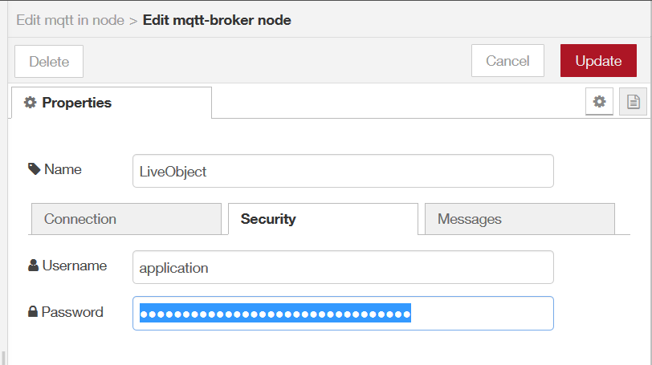
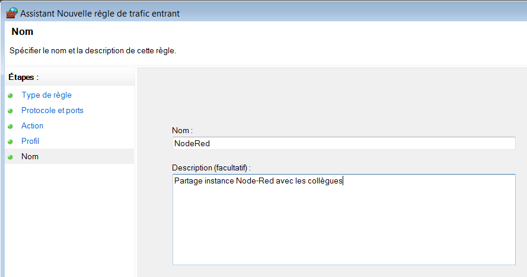

# Installation

Commencer par installer Node.js


Node.js Command Prompt


Installer Node-Red
```
npm install -g --unsafe-perm node-red
```

Installer les composants dash-board
```
npm i node-red-dashboard
```

Lancer l'instance Node-Red
```
node-red
```
Visiter le lien
[http://localhost:1880/](http://localhost:1880/) pour accéder à l'instance.


Aller dans `Manage Palette` onglet `Install` saisir le nom `node-red-dashboard` dans le champ de recherche


Cliquer sur `install`.


## Générateur de payload

Pour développer et mettre au point des composants Node-Red, il est très pratique de disposer d'un flux de donnée. Si un tel flux n'existe pas, on peut en générer un aléatoirement pour servir du contenu.

|timestamp|variable|valeur|
|--|--|--|
|1568797766760|var1| 0|
|1568797766760|var2| 2|


## Se brancher sur une fifo LiveObject par MQTT

Dans la catégorie input de la palette Node-RED, choisir l'entrée `mqtt`


Double cliquer dessus pour en éditer les propriétés.
Renseigner le nom de votre fifo dans le champ `Topic`.

Cliquer sur le bouton d'édition pour configurer un nouveau mqtt-broker.


Cliquer sur le bouton d'édition et paramétrer le client mqtt tel que présenté ci-dessous.
* Server `liveobjects.orange-business.com` port 8883
* Régler le keep alive à 30s
* Activer le SSL/TLS
* Client ID à RANDOM_STRING_xip8230
Cliquer sur le bouton d'édition pour ajouter une config TLS


Récupérer le certificat fourni à l'adresse: [https://liveobjects.orange-business.com/doc/html/lo_manual_v2.html#_server_certificates](https://liveobjects.orange-business.com/doc/html/lo_manual_v2.html#_server_certificates) et le télécharger dans un fichier `liveobject_mqtt.crt`
puis l'uploader dans la partie `Certificate`.

Décocher l'option `verify server certificate`
Donner un nom à cette configuration TLS dans le champs `Name`


Se rendre sur l'onglet Security
Saisir `application` dans le champ `Username`.
Saisir la clé API dans le champ `Password`



Une fois terminé, déployer le flow. La connection nouvellement créé doit prendre cette forme.


## Ouvrir votre instance Node-Red à vos collègues

Ouvrir le Firewall Windows





## Exemple de script

```javascript
var nmsg=null;
var event_buffer=context.get('event_buffer') || undefined;
if (event_buffer === undefined) {
    context.set('event_buffer',[]);
    context.get('event_buffer').push(msg);
    nmsg = null;
} else {
    event_buffer.push (msg)// .sort()
    while (event_buffer.length > MAX_SIZE_OF_BUFF) {
        event_buffer.shift()
    }
    if (event_buffer.length >= 1) {
        // prepare series = ["A", "B", "C"];
        let series = event_buffer.map(e=>e.payload.variable).filter((value, index, self) =>  self.indexOf(value) === index ).sort()
        //["A", "B", "C"];
        labels = event_buffer.map(e=>e.timestamp);

        let data=[];
        series.forEach(e=>data.push([]))
        event_buffer.forEach(event => {
            data[series.indexOf(event.payload.variable)].push (
                {
                    "x":event.payload.timestamp,
                    "y":event.payload.value + 2*series.indexOf(event.payload.variable)
                }    
            )
        })
        nmsg = {"payload":[{"series": series,"data": data,"labels": labels}]}
        //nmsg = {"payload":[{}]}
        //nmsg = {"payload":[{}]}        
//event_buffer//.map((elem) => elem)
    } else {
        nmsg = null;
    }
}
```

# Resources
